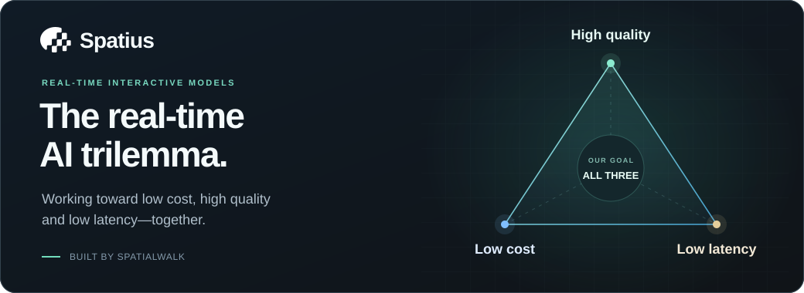

# Hi, I'm Yuhang.

**Co-founder & CTO at SpatialWalk, building [Spatius](https://www.spatius.ai).**

**我们正在挑战实时交互模型的“不可能三角”：低成本、高质量、低延迟。**

We're building toward all three with Spatius: real-time AI avatars that work with your voice stack, stream synchronized motion, and render on the user's device.

**[Try the live demo ↗](https://www.spatius.ai/playground/)** &nbsp; · &nbsp; [Website](https://www.spatius.ai) &nbsp; · &nbsp; [Documentation](https://docs.spatius.ai) &nbsp; · &nbsp; [LiveKit integration](https://docs.livekit.io/agents/models/avatar/plugins/spatius/)

### What we're building

<table>
<tr>
<td width="33%" valign="top">
<h3><a href="https://github.com/spatius-ai/create-spatius-app">create-spatius-app</a></h3>

Start a voice-avatar app with React and LiveKit or Agora.

<code>npx create-spatius-app</code>

</td>
<td width="34%" valign="top">
<h3><a href="https://github.com/spatius-ai/spatius-integration-demo">Integration demos</a></h3>

Explore Spatius integration patterns across web and mobile.

<a href="https://github.com/spatius-ai/spatius-integration-demo">Explore examples →</a>

</td>
<td width="33%" valign="top">
<h3><a href="https://github.com/spatius-ai/spatius-sdk-python">Python SDK</a></h3>

Create and manage Spatius avatar sessions from Python.

<code>pip install spatius</code>

</td>
</tr>
</table>

[More from our team →](https://github.com/spatius-ai)
